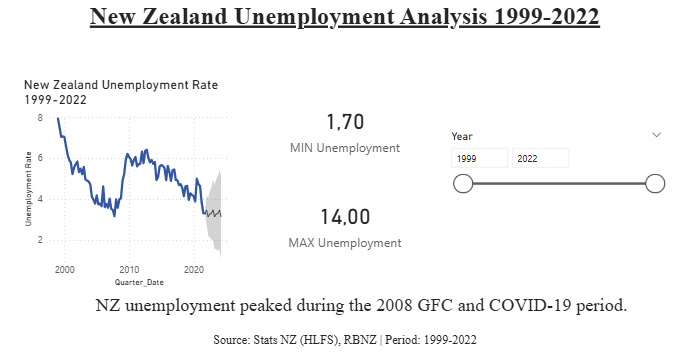
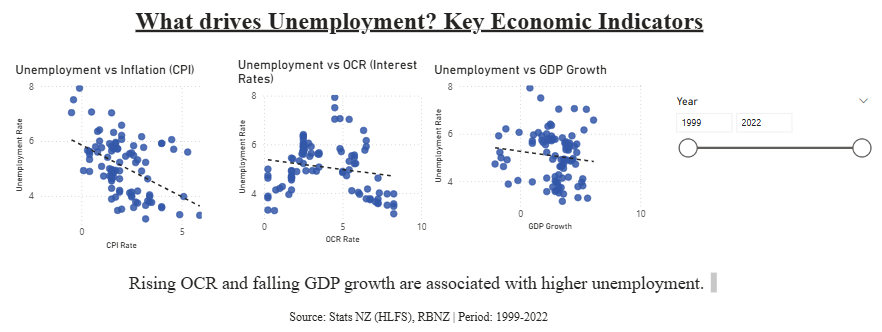
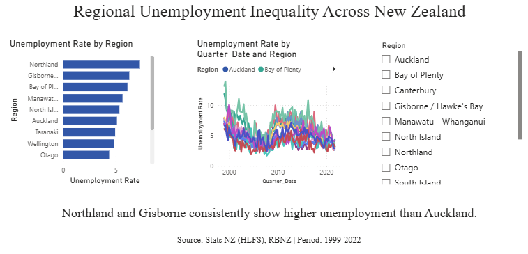

# 📊 New Zealand Unemployment Analysis (1999–2022)

An end-to-end data analytics project analysing New Zealand unemployment trends, economic drivers, and regional inequality — built in Power BI with data sourced from Stats NZ, RBNZ, and the World Bank.

---

## 🖼️ Dashboard Preview

### Page 1 — Overview


### Page 2 — Economic Drivers


### Page 3 — Regional Unemployment


---

## 🎯 Project Objectives

- Track New Zealand's unemployment rate over 23 years (1999–2022)
- Forecast future unemployment trends using Power BI's built-in forecasting
- Identify relationships between unemployment and key economic indicators (CPI, OCR, GDP)
- Compare unemployment inequality across New Zealand regions

---

## 🔍 Key Insights

- **NZ unemployment peaked during the 2008 Global Financial Crisis and the COVID-19 period**, reaching a maximum of 14% at the regional level
- **Rising OCR and falling GDP growth are associated with higher unemployment**, visible through trend lines across scatter plots
- **Northland and Gisborne consistently show higher unemployment than Auckland**, highlighting persistent regional inequality across New Zealand

---

## 🛠️ Tools & Technologies

| Tool | Purpose |
|---|---|
| Python (pandas) | Data cleaning, merging datasets, date formatting |
| Excel | Initial data exploration and inspection |
| Power BI Desktop | Data modelling, DAX measures, dashboard building |
| Power Query | Data transformation and type casting |
| DAX | Custom measures (averages, min/max, YoY change) |

---

## 📦 Data Sources

| Source | Data | Period |
|---|---|---|
| [Stats NZ — Infoshare (HLFS)](https://infoshare.stats.govt.nz) | Unemployment rate by region and quarter | 1999–2022 |
| [RBNZ](https://www.rbnz.govt.nz) | Official Cash Rate (OCR) and CPI inflation | 1999–2022 |
| [World Bank](https://data.worldbank.org) | NZ GDP growth (annual %) | 1999–2022 |

> All datasets were aligned to a common 1999 Q1 – 2022 Q4 window. Annual figures (GDP, CPI) were repeated across quarters within each year as standard practice.

---

## 📁 Project Structure

```
├── data/
│   ├── raw/                  # Original downloaded files from Stats NZ, RBNZ, World Bank
│   └── cleaned/              # Master CSV after Python cleaning
├── notebooks/
│   └── data_cleaning.py      # Python script for merging and cleaning
├── powerbi/
│   └── nz_unemployment.pbix  # Power BI project file
├── screenshots/
│   ├── overview.png
│   ├── economic_drivers.png
│   └── regional_view.png
└── README.md
```

---

## ⚙️ Data Preparation Steps

1. Downloaded unemployment by region (quarterly) from Stats NZ HLFS
2. Downloaded OCR and CPI from RBNZ
3. Downloaded GDP growth from World Bank
4. Cleaned and merged all datasets in Python using pandas:
   - Aligned date formats to quarterly periods (e.g. `1999-Q1`)
   - Repeated annual values (GDP, CPI) across all 4 quarters per year
   - Filtered all datasets to the common window: **1999 Q1 – 2022 Q4**
   - Exported as a single master CSV with columns: `Date`, `Region`, `Unemployment %`, `CPI`, `OCR`, `GDP`
5. Loaded into Power BI and built a Date Table for time intelligence

---

## 📊 Dashboard Features

- **Interactive year slicer** — filter all visuals by year range
- **Region slicer** — filter regional charts by specific NZ regions
- **8-quarter unemployment forecast** with 95% confidence interval
- **Trend lines** on all scatter plots showing economic relationships
- **Min/Max unemployment cards** for quick summary statistics

---

## 💡 How to Use

1. Clone this repository
2. Open `powerbi/nz_unemployment.pbix` in Power BI Desktop
3. If prompted, update the data source path to your local `data/cleaned/` folder
4. Refresh the data and explore the dashboard

---

## 📝 Limitations

- HLFS regional estimates carry higher sampling errors for smaller regions — minor fluctuations in smaller regions should be interpreted with caution
- CPI and OCR data from RBNZ only available to 2022, limiting the analysis window
- GDP growth is annual and repeated across quarters, which smooths quarterly variation

---

## 👤 Author

*Feel free to connect on [LinkedIn](https://www.linkedin.com/in/nicolas-mir12) or reach out for any questions about this project.*
